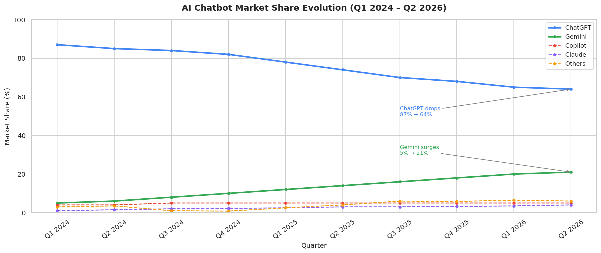
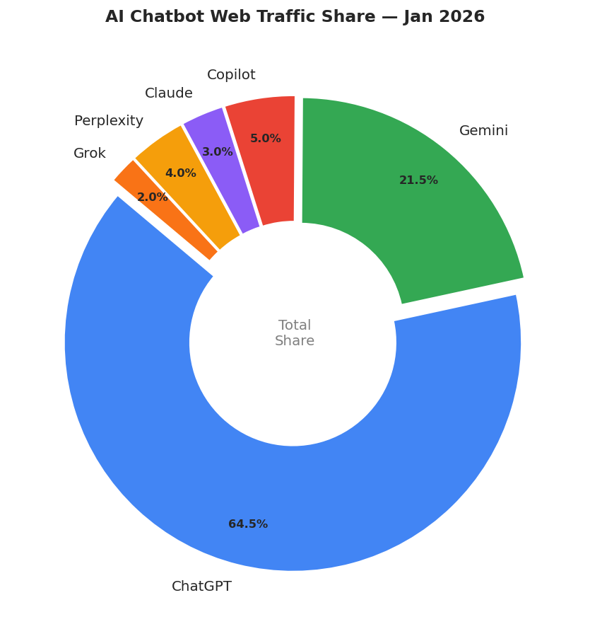
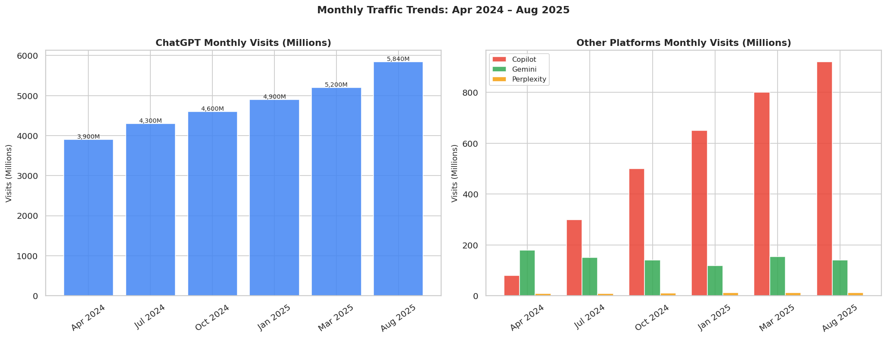
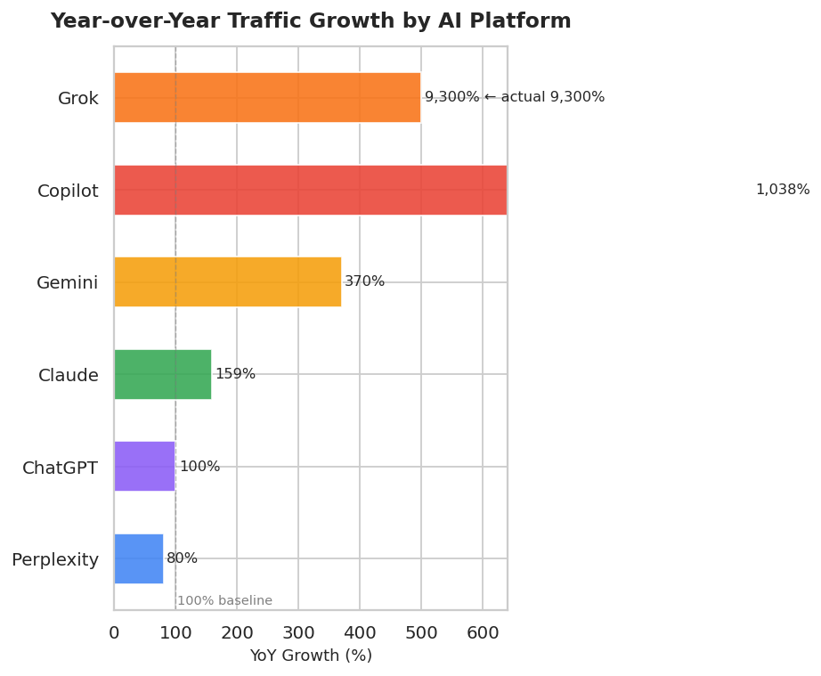
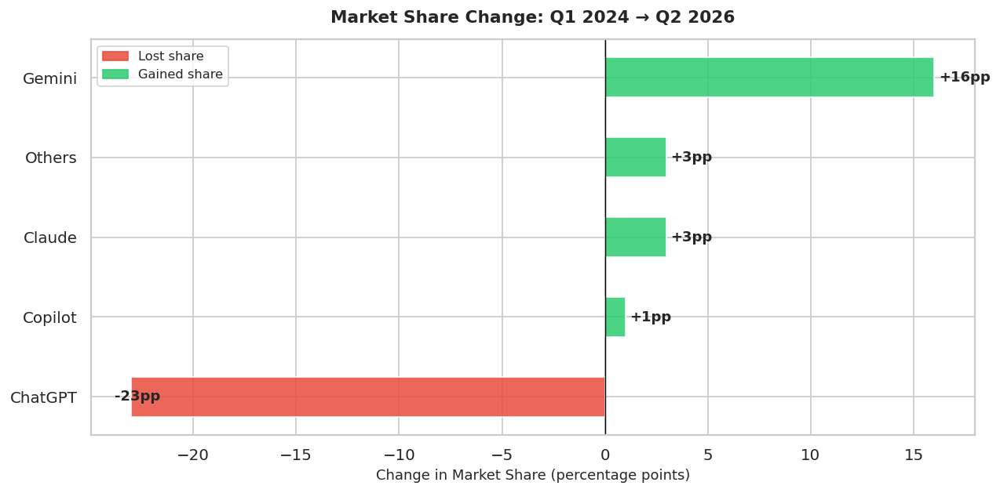

# AI Tools Trend Analysis

I was curious about how AI tools like ChatGPT, Gemini, and Claude 
are actually performing in the market — not just hype, but real 
numbers. So I put together this analysis using traffic and market 
share data from 2024 to 2026.

---

## What I looked at

- ChatGPT (OpenAI)
- Gemini (Google)
- Copilot (Microsoft)
- Claude (Anthropic)
- Perplexity
- Grok (xAI)

---

## Tools I used

Python, Pandas, Matplotlib, Seaborn, Jupyter Notebook

---

## Where the data came from

I pulled numbers from SimilarWeb, StatCounter, First Page Sage, 
and DataReportal. Instead of using a single CSV, I compiled the 
data manually from these sources directly into the notebook — 
which actually gave me more accurate and recent numbers than 
most public datasets.

---

## What I built

5 charts that tell the story of how the AI market shifted:

1. Market share trend from Q1 2024 to Q2 2026
2. Current traffic share across all 6 platforms
3. Monthly visit comparison
4. Year-over-year growth rates
5. Who gained and who lost market share

---

## Visualizations











---

## What I found

- ChatGPT went from 87% market share down to 64% — still the 
  leader but clearly losing ground
- Gemini surprised me the most — grew from 5% to 21% which 
  is a massive jump in a short time
- Claude has only 3% of web traffic but its revenue grew 159% 
  which shows enterprise customers are paying serious money for it
- Grok basically came out of nowhere — 9,300% growth in a year, 
  went from 1.7M to 160M visits in 2 months
- Copilot grew traffic by 1,038% but still sits at 5% share — 
  Microsoft's billions haven't translated to dominance yet

---

## How to run it

```bash
pip install pandas numpy matplotlib seaborn
jupyter notebook ai_tools_trend_analysis.ipynb
```

Just run the cells top to bottom. No dataset to download.

---

## Author

Yagnasree Kamireddy  
[GitHub](https://github.com/yagnasreekamireddy)
